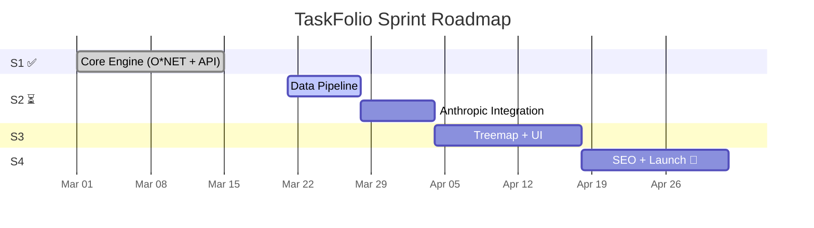
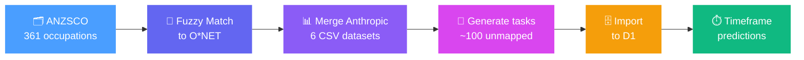
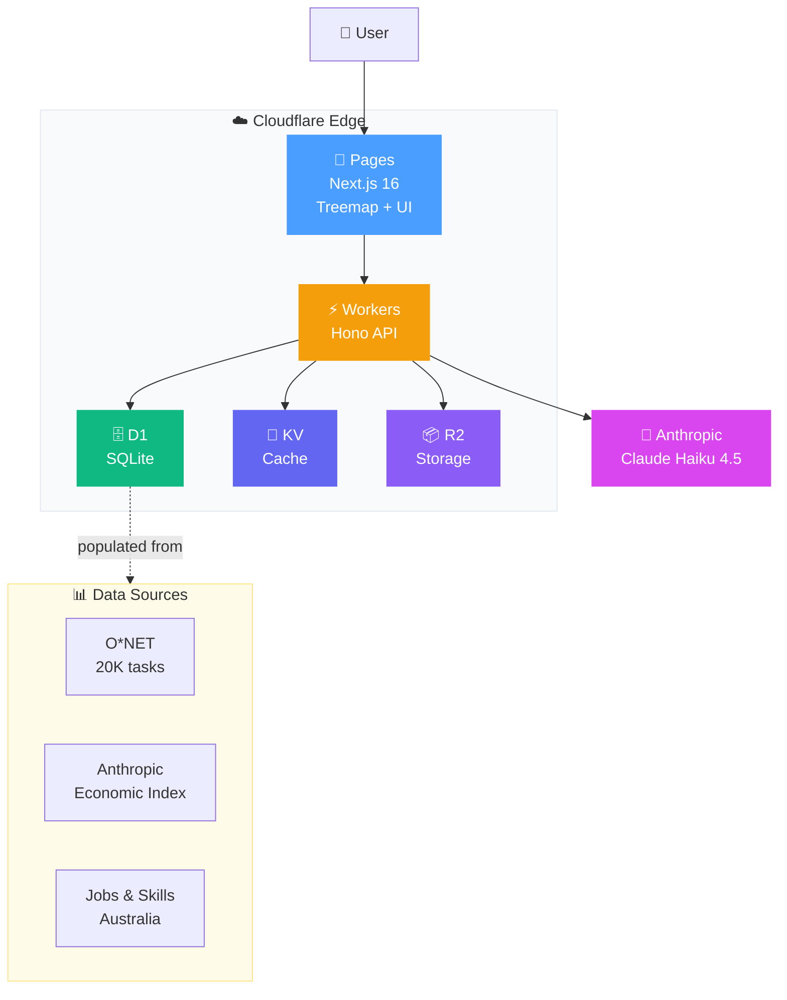
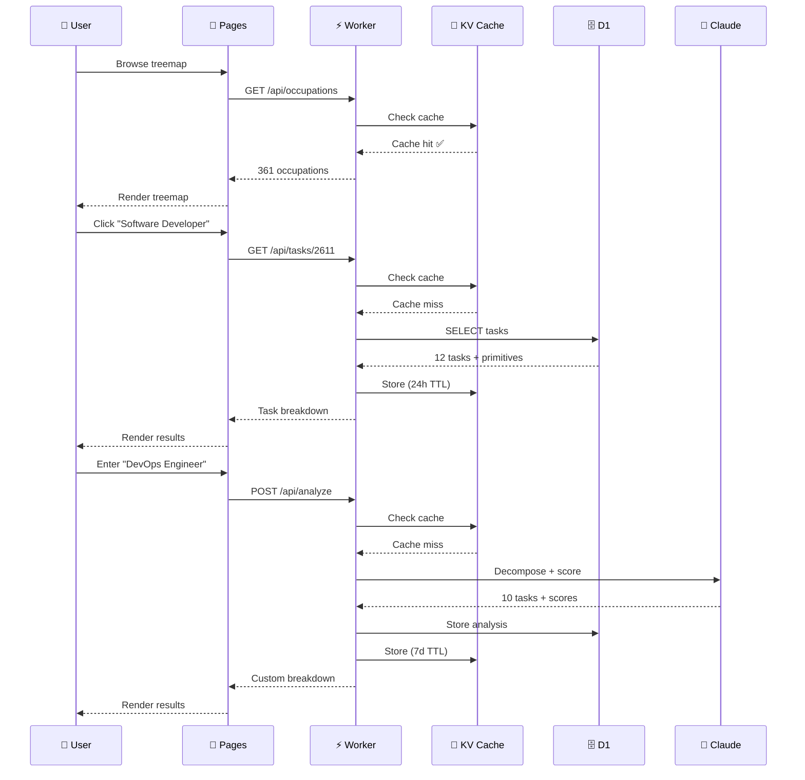

# TaskFolio 📋

**See exactly which parts of your job AI will affect — task by task, with timeframes and success rates backed by 1M real conversations.**

TaskFolio is the first task-level AI exposure analysis tool for the Australian job market, helping 14.4M workers understand which specific parts of their job AI will affect — and when.

## The Problem

Existing tools show occupation-level AI exposure ("Software Developer: 9/10") with no actionable breakdown. Workers need to know:

- **Which specific tasks** in their job are changing
- **How soon** each task will be affected (0-2 years, 2-5 years, 10+ years)
- **How reliable** AI is for each task (success rates from real usage)
- **What to do** — learn, automate, or delegate

## How It Works


1. **Browse** 361 ANZSCO occupations on the treemap, or **enter any job title**
2. **TaskFolio decomposes** the role into 8–15 core tasks using O\*NET data + AI
3. **Each task gets scored** with economic primitives: exposure, success rate, speedup, timeframe
4. **See your exposure profile** — which tasks are safe, which are changing, and when

## Example: "Software Developer"

| Task | Exposure | Timeframe | Success Rate |
|---|---|---|---|
| Write production code | 85/100 | 0-2 years | 61% |
| Debug complex systems | 70/100 | 0-2 years | 65% |
| Design system architecture | 60/100 | 2-5 years | 55% |
| Mentor junior developers | 30/100 | 10+ years | 40% |

## Features

- ✅ O\*NET integration — 101 occupations with validated task breakdowns
- ✅ ANZSCO mapping for Australian job titles
- ✅ AI-powered decomposition for any role (Claude Haiku 4.5)
- ✅ Per-task AI exposure scoring with reasoning and timeframes
- ✅ Frequency-weighted job-level exposure score
- ✅ Task validation by users (agree/disagree/edit)
- ✅ 25 tests (decompose, AI exposure, O\*NET)
- 🔜 Anthropic Economic Index integration (1M real conversations)
- 🔜 361 ANZSCO occupations (treemap landing page)
- 🔜 Economic primitives (success rate, speedup, autonomy)
- 🔜 Shareable task portfolio links
- 🔜 SEO pages for top 50 job titles
- 🔜 Employer dashboard (B2B)

---

## Sprint Plan



| Sprint | Focus | Shape | Status |
|---|---|---|---|
| **S1** | Core Engine | O\*NET data + decomposition + scoring + API | ✅ Done |
| **S2** | Data Expansion | Anthropic Economic Index + 361 occupations + D1 | ⏳ Next |
| **S3** | Frontend | Treemap + task breakdown UI + mobile + dark mode | Not started |
| **S4** | Launch | SEO + analytics + legal + go live | Not started |

### S1 — Core Engine ✅

**Shape:** Build the decomposition pipeline — any job title in, scored task breakdown out.

**Delivered:**
- `lib/onet.ts` — O\*NET occupation lookup + task retrieval (101 occupations, 4.6MB dataset)
- `lib/decompose.ts` — Claude Haiku task decomposition for any job title
- `lib/ai-exposure.ts` — Per-task AI exposure scoring (0-100) with reasoning + timeframes
- `app/api/analyze/route.ts` — POST endpoint: job title → scored task breakdown
- `app/api/occupations/search/route.ts` — Search O\*NET occupations by title
- `app/api/occupations/[socCode]/route.ts` — Get occupation details
- `db/schema/index.ts` — Drizzle schema (users, job_profiles, tasks, task_validations)
- `scripts/import-onet.py` — O\*NET data import pipeline
- `__tests__/` — 25 tests across 3 test files

### S2 — Data Expansion (Next)

**Shape:** Integrate Anthropic Economic Index for research-backed primitives. Expand 101 → 361 occupations. Migrate to Cloudflare D1.



**Stories:**
1. ANZSCO → O\*NET fuzzy mapping (361 occupations, confidence >0.7)
2. Merge 6 Anthropic CSV datasets (tasks, automation, primitives, usage, wages, employment)
3. Generate tasks for ~100 unmapped occupations via Claude Haiku
4. Import to Cloudflare D1 with economic primitives
5. Timeframe predictions + TaskFolio composite scores

**Exit criteria:** 361 occupations, 4,000-5,000 tasks, all with economic primitives in D1.

---

## Data Pipeline Methodology

### ANZSCO → O*NET Mapping Challenge

**Problem:** Australian (ANZSCO) and US (O*NET) occupation taxonomies use different naming conventions. Example:

| ANZSCO | O*NET | Match? |
|---|---|---|
| Registered Nurses | Registered Nurses | ✅ 1.0 |
| Software and Applications Programmers | Software Developers, Applications | ✅ 0.86 |
| Chefs | **Chemists** | ❌ 0.62 (garbage) |
| Police | **Producers** | ❌ 0.53 (garbage) |

**Solution:** Fuzzy string matching (`difflib.SequenceMatcher`) with confidence filtering.

### Two-Tier Data Strategy

**Tier 1 — High Confidence Matches (147 occupations)**
- Confidence >0.7 threshold
- Use Anthropic Economic Index data (backed by 1M real conversations)
- Get research-grade metrics: automation %, success rate, time savings, economic primitives

**Tier 2 — Low Confidence / Unmapped (214 occupations)**
- Confidence <0.7 or no match found
- Generate tasks using Claude Sonnet 4.5
- Australian-specific context (regulations, industry structure, geography)
- 15-20 tasks per occupation with AI impact scoring

### Why Not Force-Fit Poor Matches?

Using "Chemists" tasks for "Chefs" would pollute the dataset with:
- Wrong task descriptions (chemistry lab work vs kitchen operations)
- Incorrect AI exposure scores (lab automation vs culinary creativity)
- Misleading timeframes and success rates

**Trade-off:** Tier 2 tasks are AI-generated templates rather than research-backed, but they're **occupation-specific** and **Australian-context-aware** — better than wrong O*NET data.

### Final Dataset

| Source | Occupations | Tasks | Quality |
|---|---|---|---|
| **Anthropic Economic Index** | 147 | 3,074 | Research-grade (1M conversations) |
| **Claude Sonnet Generated** | 214 | 3,616 | AI templates (Australian context) |
| **Total** | **361** | **6,690** | Mixed quality, 100% coverage |

---

### S3 — Frontend

**Shape:** D3.js treemap landing page (fork ychua's proven UX) + task breakdown detail view + custom job input form. Mobile responsive, dark mode, Australian context.

### S4 — Launch

**Shape:** SEO pages for top 50 occupations, Cloudflare Web Analytics, legal (privacy, terms, CC-BY attribution), launch content for HN/Reddit/AU tech press.

**Target:** 1,000 unique visitors, 100+ custom analyses, HN front page.

---

## Project Artifacts

```
task-folio/
├── app/
│   ├── page.tsx                          # Landing page
│   ├── layout.tsx                        # Root layout
│   ├── globals.css                       # Tailwind styles
│   └── api/
│       ├── analyze/route.ts              # POST — decompose + score job
│       └── occupations/
│           ├── search/route.ts           # GET — search by title
│           └── [socCode]/route.ts        # GET — occupation details
├── lib/
│   ├── onet.ts                           # O*NET data access (101 occupations)
│   ├── decompose.ts                      # Claude Haiku task decomposition
│   └── ai-exposure.ts                    # AI exposure scoring engine
├── db/
│   ├── index.ts                          # Drizzle client
│   ├── schema/index.ts                   # Tables: users, job_profiles, tasks, task_validations
│   └── migrations/                       # SQL migrations
├── data/
│   ├── onet/occupations.json             # O*NET occupation data
│   └── onet-full.json                    # Full O*NET dataset (4.6MB)
├── scripts/
│   └── import-onet.py                    # Data import pipeline
├── __tests__/
│   ├── onet.test.ts                      # O*NET lookup tests
│   ├── decompose.test.ts                 # Decomposition tests
│   └── ai-exposure.test.ts              # Scoring tests
├── docs/
│   ├── PROJECT_OVERVIEW.md               # Full spec, competitive analysis, budget
│   ├── SPRINT_PLAN.md                    # Sprint execution details
│   └── ARCHITECTURE.md                   # System design, Cloudflare stack, ADRs
├── .beads/                               # Issue tracking (bd)
├── package.json                          # Next.js 16, Drizzle, Anthropic SDK
├── drizzle.config.ts                     # Drizzle ORM config
├── vitest.config.ts                      # Test runner config
└── AGENTS.md                             # Agent instructions + bd workflow
```

## Architecture



## Tech Stack

| Layer | Choice |
|-------|--------|
| Framework | Next.js 16 (App Router, TypeScript) |
| Styling | Tailwind CSS |
| Visualization | D3.js (treemap, S3) |
| ORM | Drizzle |
| Database | PostgreSQL (Neon) → Cloudflare D1 (S2) |
| LLM | Anthropic Claude Haiku 4.5 |
| Deployment | Cloudflare Pages + Workers (S2+) |

## Data Sources

- [Anthropic Economic Index](https://www.anthropic.com/research/anthropic-economic-index-january-2026-report) (CC-BY) — 1M real AI conversations classified by economic task
- [Jobs and Skills Australia](https://www.jobsandskills.gov.au/) — Employment and wage data
- [O\*NET](https://www.onetonline.org/) — 20,000 pre-classified occupational tasks
- [ychua/jobs](https://github.com/ychua/jobs) — ANZSCO occupation pipeline (OSS)

## Request Flow



## API Endpoints

```
POST /api/analyze              — Decompose job + score AI exposure
GET  /api/occupations/search   — Search O*NET occupations
GET  /api/occupations/[code]   — Get occupation details + tasks
```

## Development

```bash
pnpm install
pnpm dev       # Start dev server at localhost:3000
pnpm test      # Run tests (25 tests)
pnpm build     # Production build
```

Requires `ANTHROPIC_API_KEY` in `.env` for LLM features. Copy `.env.example` to `.env.local`.

## Documentation

- [Project Overview](docs/PROJECT_OVERVIEW.md) — Full spec, competitive analysis, budget, risks
- [Sprint Plan](docs/SPRINT_PLAN.md) — Sprint execution with stories, acceptance criteria, scripts
- [Architecture](docs/ARCHITECTURE.md) — System design, API routes, Cloudflare stack, cost analysis, ADRs

## Attribution

Task data sourced from the [Anthropic Economic Index](https://www.anthropic.com/research/anthropic-economic-index-january-2026-report) (CC-BY). Employment and wage data from [Jobs and Skills Australia](https://www.jobsandskills.gov.au/).

## Research Basis

Built on the "jobs as bundles of tasks" framework (Autor, Zweig). O\*NET provides the occupational taxonomy. AI exposure scoring uses the Anthropic Economic Index as the baseline.

## License

MIT
