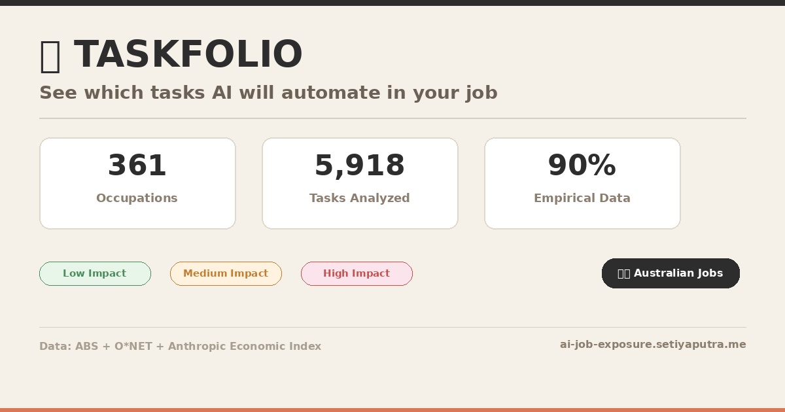
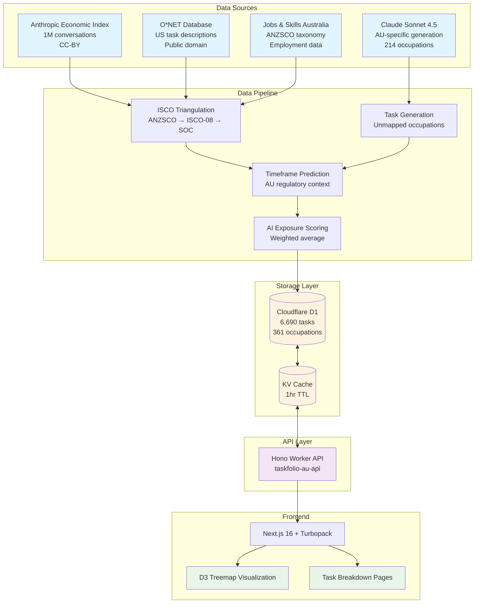
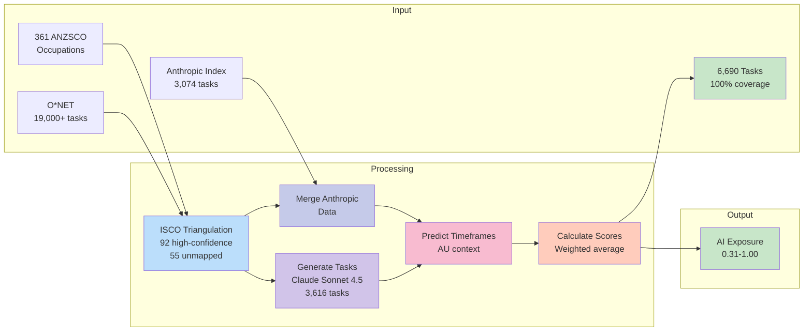
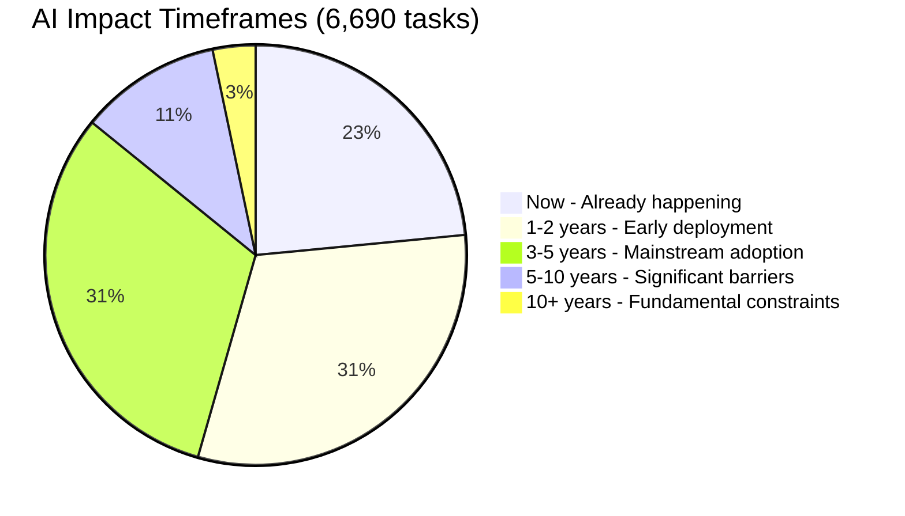

# TaskFolio 📋

[](https://opensource.org/licenses/MIT)
[](https://ai-job-exposure.setiyaputra.me)
[](https://pages.cloudflare.com/)
[](https://www.typescriptlang.org/)
[](https://nextjs.org/)
[](https://ai-job-exposure.setiyaputra.me)
[](https://ai-job-exposure.setiyaputra.me)

**See exactly which parts of your job AI will affect — task by task, with timeframes.**



TaskFolio is a task-level AI exposure analysis tool for the Australian job market, helping 14.4M workers understand which specific parts of their job AI will affect — and when.

🌐 **Live:** [ai-job-exposure.setiyaputra.me](https://ai-job-exposure.setiyaputra.me)  
📊 **361 occupations** • **6,690 tasks**  
🎨 **Design:** [Neobrutal UI](https://www.neobrutalui.live)

---

## About

Existing tools show occupation-level AI exposure ("Software Developer: 9/10") with no actionable breakdown. TaskFolio breaks jobs into individual tasks and shows:

- **Which specific tasks** in your job are changing
- **How soon** each task will be affected (now, 1-2y, 3-5y, 5-10y, 10y+)
- **How much** AI will help vs. replace (automation % vs augmentation %)
- **Employment outlook** — 10-year growth projections from Jobs and Skills Australia

---

## 🎯 Personal Risk Profiler

Get a personalised AI exposure analysis for YOUR specific job — no install, no API keys, no data leaves your machine.

### Quick Start

```bash
# 1. Clone the repo
git clone https://github.com/suryast/task-folio.git
cd task-folio

# 2. Run the profiler (zero dependencies — stdlib only, no pip install needed)
cd scripts
python3 -m profiler
```

That's it. No `npm install`, no `pip install`, no API keys. The profiler uses only Python standard library and reads data directly from the repo.

### What You Get

```
━━━━━━━━━━━━━━━━━━━━━━━━━━━━━━━━━━━━━━━━━━━━━━━━━━━━━━━━━━━━━━
  🎯  YOUR PERSONAL AI EXPOSURE REPORT
━━━━━━━━━━━━━━━━━━━━━━━━━━━━━━━━━━━━━━━━━━━━━━━━━━━━━━━━━━━━━━

  Software Engineer  (ANZSCO 2613)
  Analyzing 8 of 18 tasks

──────────────────────────────────────────────────────────────
  📊 EXPOSURE SCORES
──────────────────────────────────────────────────────────────

  Overall Exposure    ████████████████░░░░░░░░░░░░░░  53%  🟡 MEDIUM
  🤖 Automation Risk  ██████░░░░░░░░░░░░░░░░░░░░░░░░  18%
  🧠 Augmentation     ██████████░░░░░░░░░░░░░░░░░░░░  35%

──────────────────────────────────────────────────────────────
  ⏳ WHEN WILL AI AFFECT YOUR WORK?
──────────────────────────────────────────────────────────────

  ⚡ Happening now    █████████░░░░░░░░░░░░░░░░  38%
  📅 1-2 years        ████████░░░░░░░░░░░░░░░░░  30%
  🔮 3-5 years        █████░░░░░░░░░░░░░░░░░░░░  22%
  🌅 5-10 years       ██░░░░░░░░░░░░░░░░░░░░░░░  10%
```

### How It Works

1. **Search** for your occupation (fuzzy matching across 361 Australian jobs)
2. **Select** which tasks you actually perform day-to-day
3. **Allocate** your time across selected tasks
4. **(Optional)** Enrich with a local LLM for personalised insights
5. **Get** a colour-coded terminal report + Markdown + self-contained HTML

### Requirements

- Python 3.11+
- (Optional) [Ollama](https://ollama.ai) or any OpenAI-compatible local LLM for enrichment — the profiler works without it

### For AI Coding Agents

Point your agent (Claude Code, Cursor, Codex, etc.) at this repo. See [`AGENTS.md`](AGENTS.md) for:
- **Chat-based profiling** — agents ask you questions conversationally and build your profile through dialogue
- **Programmatic API** — import the profiler modules directly for scripting

---

## System Architecture



---

## Data Pipeline



---

## Timeframe Distribution



| Timeframe | Tasks | % |
|-----------|-------|---|
| Now | 1,570 | 23.5% |
| 1-2 years | 2,071 | 31.0% |
| 3-5 years | 2,103 | 31.4% |
| 5-10 years | 726 | 10.9% |
| 10+ years | 220 | 3.3% |

---

## AI Exposure Examples

**Highest AI Exposure (90-100%):**
- Legislators, Greenkeepers, Retail Managers, Sales Managers, General Managers

**Medium AI Exposure (60-80%):**
- Sales Assistants (73%), Teachers (75%), Software Developers (85%), Accountants (78%)

**Lowest AI Exposure (30-40%):**
- Domestic Cleaners (31%), Actors/Dancers (33%), Car Detailers (34%), Kitchenhands (38%)

---

## Methodology (V1.2)

Full methodology: [docs/METHODOLOGY.md](docs/METHODOLOGY.md)

### Core Metrics

| Metric | Definition |
|--------|------------|
| **AI Exposure** | Weighted average of task-level automation + augmentation (0-100%) |
| **Half-Life** | Estimated years until AI can perform ~50% of occupation tasks |
| **Future-Proof Index** | Composite of AI exposure (40%), pay risk (30%), employment outlook (30%) |

### V1.1 Additions

Inspired by [AI Work Index](https://aiworkindex.pages.dev/) (Singapore) by [@kirso](https://github.com/kirso):

| Metric | Definition |
|--------|------------|
| **Impact Type** | 2×2 classification: At Risk, Augmented, Stable, or Mixed |
| **Displacement Score** | `exposure × (1 - bottleneck)` — how much AI replaces |
| **Augmentation Score** | `exposure × bottleneck` — how much AI amplifies |
| **Risk Band** | 5-tier scale: Very Low → Low → Moderate → High → Very High |
| **Data Confidence** | High/Medium/Low based on mapping method |

### V1.2: ISCO Triangulation

Improved occupation mapping using official international crosswalks:

```
ANZSCO (AU) ──→ ISCO-08 (ILO) ──→ SOC (US/O*NET)
    │              │                │
    └──ABS─────────┴──BLS───────────┘
       concordance    crosswalk
```

| Mapping Method | Occupations | Confidence |
|----------------|-------------|------------|
| ISCO Triangulation | 92 (62.6%) | High |
| Fuzzy Title Match | 55 (37.4%) | Low |

**Impact Type Matrix:**

|  | Low Augmentation | High Augmentation |
|--|------------------|-------------------|
| **High Displacement** | At Risk | Mixed |
| **Low Displacement** | Stable | Augmented |

The bottleneck factor is calculated from the ratio of augmentation-oriented vs automation-oriented tasks in each occupation.

### V1.3: Enhanced Occupation Matching (2026-03-24)

Major improvement to ANZSCO → O\*NET SOC mapping accuracy:

| Confidence Tier | Before | After | Change |
|-----------------|--------|-------|--------|
| 🟩 High (≥0.8) | 63 | **210** | +147 |
| 🟨 Medium (0.7-0.8) | 84 | **111** | +27 |
| ⬜ Low (unmapped) | 214 | **40** | -174 |

**Coverage: 93% of occupations now have verified O\*NET mappings** (up from 41%).

Improvements:
- **Manual overrides** for 95 high-employment AU occupations (Sales Assistants → Retail Salespersons, Truck Drivers → Heavy Truck Drivers, Software Programmers → Software Developers, etc.)
- **Enhanced fuzzy matching** with weighted multi-strategy scoring (token_sort + token_set + partial_ratio)
- **Full O\*NET occupation list** (1,016 SOC codes) used as matching target
- **New treemap grouping** — "Group by: Data Confidence" shows mapping quality distribution
- **Backfilled taskfolio_score** for 1,362 O\*NET tasks that were missing scores
- **Normalized source labels** — canonical `onet`, `anthropic`, `synthetic` across D1, frontend, and pipeline

Remaining 40 unmapped occupations are AU-specific roles with no clean O\*NET equivalent (e.g., Aboriginal Health Workers, specific AU regulatory roles). These continue using LLM-generated task data.

### V1.2.1: Data Source Label Fix (2026-03-24)

Fixed a bug where the **Data Confidence** widget on occupation pages showed `0/N` for both Empirical and Synthetic task counts. The frontend was filtering for legacy source labels (`onet`, `synthetic`, `llm`) that no longer matched the D1 data after the O\*NET v2 regeneration:

| Frontend expected | Actual D1 value | Count |
|-------------------|-----------------|-------|
| `onet` | `onet_v2` | 1,362 |
| `synthetic` / `llm` | `claude_generated` | 3,616 |
| `anthropic` | `anthropic` | 1,097 ✅ |

Updated `OccupationClient.tsx` source filters to match all current D1 source labels.

---

## Data Sources

| Source | Description |
|--------|-------------|
| [Anthropic Economic Index](https://www.anthropic.com/research/anthropic-economic-index-january-2026-report) | Task automation/augmentation from 1M AI conversations (CC-BY 4.0) |
| [O*NET Database](https://www.onetonline.org/) | US occupational task descriptions (Public Domain) |
| [Jobs and Skills Australia](https://www.jobsandskills.gov.au/) | ANZSCO taxonomy, employment data, wages |
| [JSA Employment Projections](https://www.jobsandskills.gov.au/data/employment-projections) | 10-year employment growth forecasts (May 2025 → May 2035) |
| [ISCO-08](https://www.ilo.org/public/english/bureau/stat/isco/isco08/) | ILO International Standard Classification of Occupations |
| [ABS ANZSCO-ISCO Concordance](https://www.abs.gov.au/statistics/classifications/anzsco-australian-and-new-zealand-standard-classification-occupations/2022) | Official ANZSCO → ISCO-08 mapping |
| [BLS SOC-ISCO Crosswalk](https://www.bls.gov/soc/soccrosswalks.htm) | Official SOC → ISCO-08 mapping |

---

## Tech Stack

| Layer | Technology |
|-------|------------|
| Frontend | Next.js 16, React, D3.js |
| API | Hono (Cloudflare Workers) |
| Database | Cloudflare D1 (SQLite) |
| Hosting | Cloudflare Pages |

**Cost:** $0/month (Cloudflare free tier)

---

## Local Development

```bash
# Clone and install
git clone https://github.com/suryast/task-folio.git
cd task-folio
pnpm install

# Run frontend
pnpm dev

# Run API (separate terminal)
cd api && pnpm dev
```

---

## License

- **Code:** MIT License
- **Data:** Per source terms (see [Attribution](https://ai-job-exposure.setiyaputra.me/legal/attribution))

---

## Acknowledgments

- [Anthropic](https://www.anthropic.com/research/anthropic-economic-index-january-2026-report) for the Economic Index (1M conversation dataset)
- [O*NET Program](https://www.onetonline.org/) (US Dept of Labor/ETA) for task descriptions
- [Jobs and Skills Australia](https://www.jobsandskills.gov.au/) for ANZSCO taxonomy and employment data
- [Autor, Levy & Murnane (2003)](https://economics.mit.edu/sites/default/files/publications/the%20skill%20content%202003.pdf) for the "jobs as tasks" framework
- [@karpathy](https://github.com/karpathy) for the original [US Job Market Visualizer](https://karpathy.ai/jobs)
- [@ychua](https://github.com/ychua) for the [Australian adaptation](https://github.com/ychua/jobs) with LLM-powered scoring pipeline
- [@kirso](https://github.com/kirso) for [AI Work Index](https://aiworkindex.pages.dev/) (Singapore) — V1.1 methodology inspiration (2×2 impact classification, risk bands, confidence scoring)
- [Cloudflare](https://www.cloudflare.com/) for infrastructure

---

## Citation

```bibtex
@software{taskfolio2026,
  author = {Setiyaputra, Surya},
  title = {TaskFolio: Task-level AI Exposure Analysis for Australian Occupations},
  year = {2026},
  url = {https://github.com/suryast/task-folio}
}
```

---

Built in Sydney, Australia 🇦🇺
